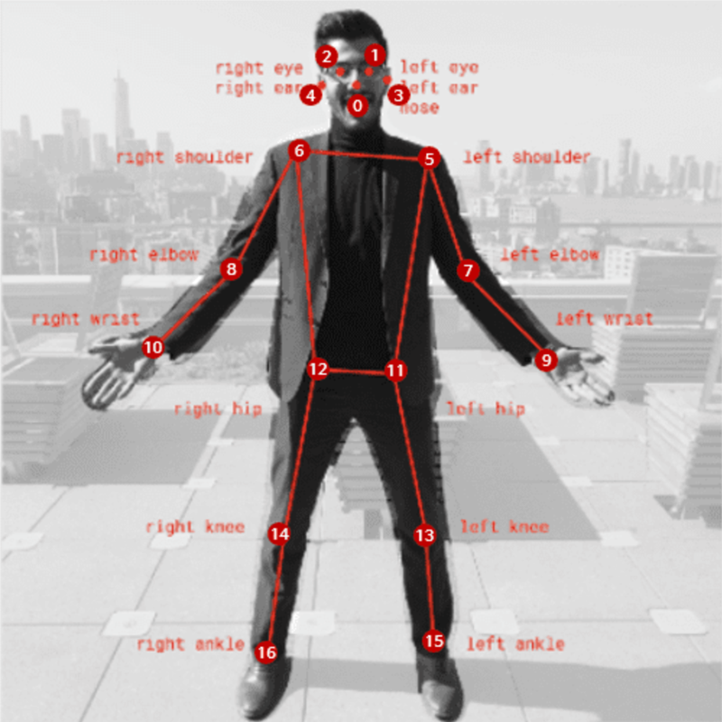
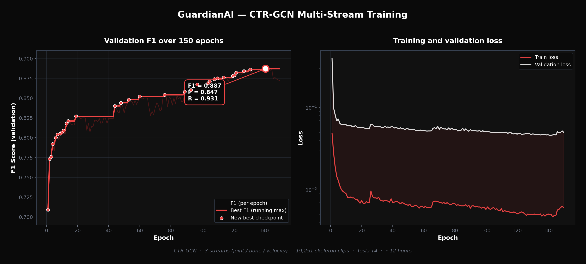

# AI Guardian

AI Guardian is a system that helps schools and other public places react faster when a fight or other physical violence happens. Cameras are already everywhere, but most of the time nobody is actually watching the screen. By the time someone notices, the harm is usually already done. The idea here is to let the computer watch the video for you and warn a real person within a few seconds.

## Privacy first

The system does not try to recognize faces. It only looks at the body and at how the person is moving. Every person on screen becomes a set of skeleton points, and that is the only thing the model sees. The people in the frame stay anonymous.

## How it works

There are two stages in the pipeline. The first one is YOLO11n-Pose. It finds the people in the video and pulls out their skeleton points. The second stage is a CTR-GCN graph network. It looks at how those skeletons move in time and decides if the motion looks aggressive. When the score is high enough, the system sends a Telegram message with a screenshot to the security team, and a human takes the final call.

## Training

The model was trained on a dataset of fight and normal clips. The picture above shows how the accuracy and the loss changed during training.

## What is in this repository

This repository only has the web side of the project. That is the landing page, the login screen and the dashboard. The model itself, the camera pipeline and the alert backend are in a different place because that part is still being trained and tuned.
